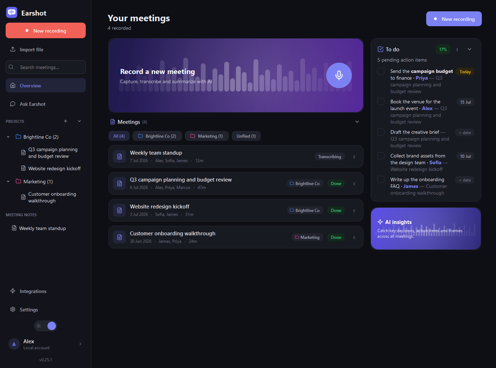
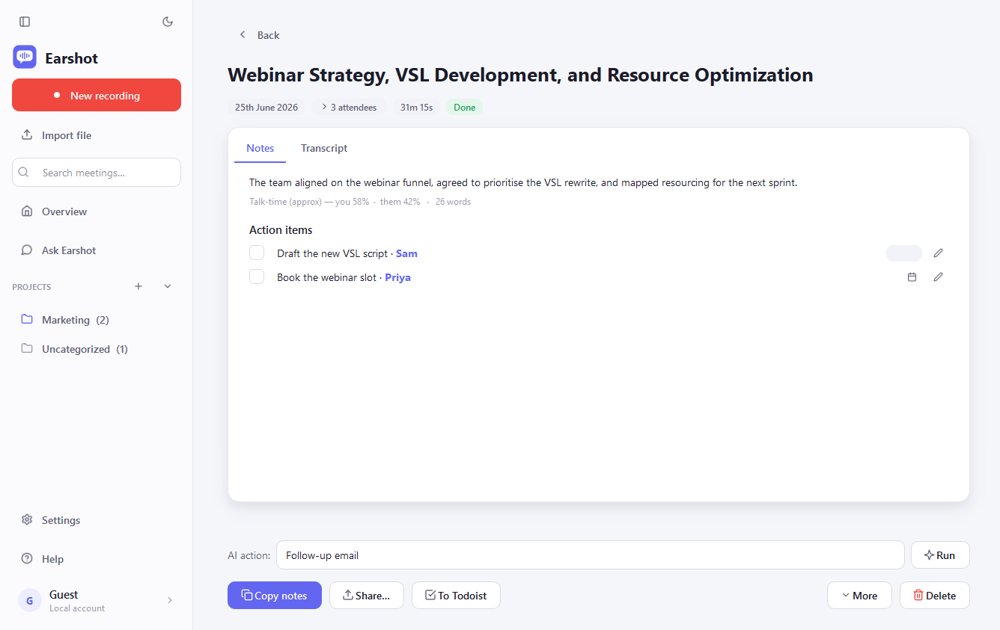
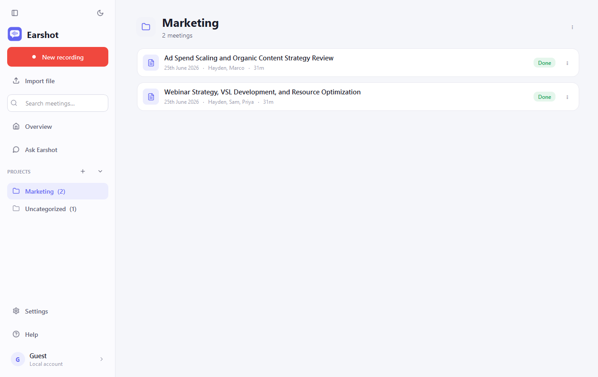
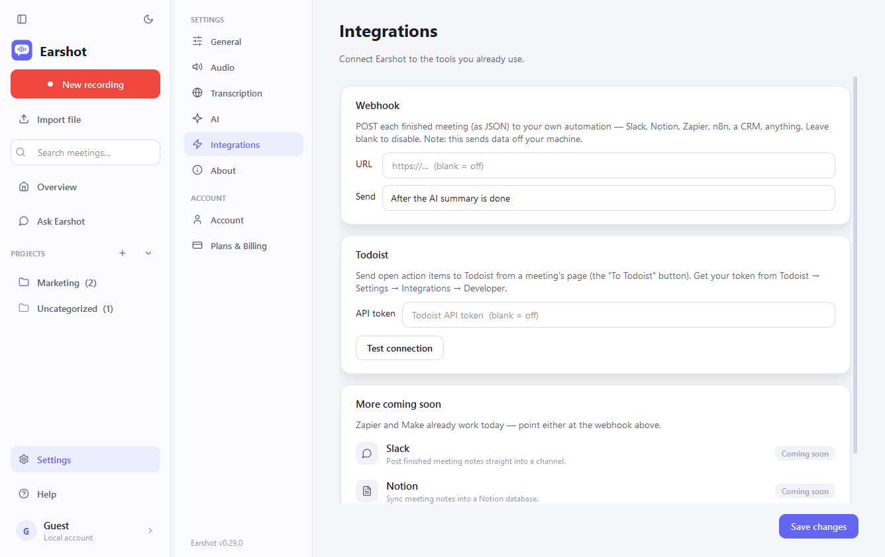

<div align="center">


# Earshot

**AI meeting notes. No bot in your call.**

A local-first meeting recorder and AI note-taker for Windows — it records both
sides of any call on your PC, transcribes them, and writes the notes, action
items and answers. Nothing joins your meeting, and no cloud touches your audio
unless you choose one.

[](https://github.com/haydenw22/earshot-meeting-notes/releases/latest)
[](https://github.com/haydenw22/earshot-meeting-notes/actions/workflows/ci.yml)
[](LICENSE)
[](https://github.com/haydenw22/earshot-meeting-notes/releases/latest)
[](https://tryearshot.app)



</div>

## Get it

- **[Download the installer](https://github.com/haydenw22/earshot-meeting-notes/releases/latest/download/EarshotSetup.exe)**
  (Windows 10/11, 64-bit). SmartScreen may warn — the installer is new and
  unsigned; it's built from the source in this repo. *More info → Run anyway.*
- A first-run **setup guide** walks you through the choice:
  - **Self-host — free forever.** Bring your own keys (Groq's free tier
    transcribes generously; any Anthropic / OpenAI-compatible / local model
    writes the notes) or point it at your own Whisper server.
  - **[Earshot Plus](https://tryearshot.app/pricing)** — managed transcription
    + AI, zero keys, zero setup. $9/month, 7-day free trial. It's how the
    project pays for itself.

## Why Earshot

Every mainstream meeting-notes tool either sends a **bot** into your call
(awkward, blockable, sometimes against policy) or keeps your **recordings and
transcripts in their cloud** — and several train their own models on your
de-identified data by default. Earshot does neither:

- It records on **two separate channels** right on your PC — your microphone
  ("me") and the system audio ("them"). Works with Zoom, Teams, Meet, Webex, a
  softphone — anything you can hear.
- Speaker attribution is **ground truth**, not diarization guesswork — your
  voice and theirs are physically separate recordings.
- Echo cancellation (WebRTC AEC3, offline) removes *their* voice from *your*
  mic when you're on speakers, without ducking you when you talk over someone.
- Multi-hour meetings are split at quiet moments, transcribed (in parallel on
  cloud providers) and stitched back together automatically.

## What you get

| | |
|---|---|
|  | **Notes that end with action.** A tight summary, the decisions, and action-item *suggestions* you approve, edit or dismiss — with due dates filled only when the meeting actually named one. Open items from every meeting roll up into one to-do list. |
|  | **Organised the way you work.** Colour-coded projects in a clean sidebar (with an Uncategorized inbox for everything else), one-click filing from any meeting, full-text search, pre-meeting briefs built from your past meetings, and a light/dark theme that follows your taste. |
|  | **Plays well with your tools.** One-click action items → Todoist (due dates included), a webhook that POSTs finished meetings anywhere Zapier/Make can reach, and clean rich-text copy that pastes perfectly into Notion or email. |

And the rest: **Ask Earshot** natural-language Q&A across every meeting with
citations verified verbatim against the transcripts · call detection that
offers to record when a meeting app starts using your mic · an always-on-top
recording overlay with per-channel level lights · bookmarks while recording ·
talk-time analytics · optional screen-capture context · import of existing
audio/video · crash-safe recording with automatic salvage · a "no input
detected" warning before you waste an hour.

## How it compares

Otter, Fireflies, Fathom and Granola are all capable tools — most now offer
some bot-free capture. What none of them offer is this combination:

| | Earshot | Typical cloud notetaker |
|---|---|---|
| Recordings & transcripts | **Your PC only** | Vendor's cloud (usually US) |
| Open source | **Yes — MIT, this repo** | No |
| Bring your own AI / fully local | **Yes** | No |
| Trains its models on your data | **Never** | Often, by default (opt-out) |
| Price | **Free self-hosted · $9/mo managed** | ~$8–20/user/mo |

Detailed, fact-checked head-to-heads (verified against each vendor's official
pages): [vs Granola](https://tryearshot.app/earshot-vs-granola) ·
[vs Otter](https://tryearshot.app/earshot-vs-otter) ·
[vs Fireflies](https://tryearshot.app/earshot-vs-fireflies) ·
[vs Fathom](https://tryearshot.app/earshot-vs-fathom) ·
[full comparison](https://tryearshot.app/earshot-vs-alternatives). Related
guides: [recording consent laws](https://tryearshot.app/recording-consent-laws)
· [local vs cloud transcription](https://tryearshot.app/local-vs-cloud-meeting-transcription).

## Self-host quickstart (from source)

Requirements: Windows 10/11, **Python 3.12**.

```sh
py -3.12 -m venv .venv
.venv/Scripts/python -m pip install -r requirements.lock.txt   # pinned, known-good
.venv/Scripts/python main.py
```

The setup guide runs on first launch. For transcription, point it at one of:

- your own [`whisper-asr-webservice`](https://github.com/ahmetoner/whisper-asr-webservice)
  container (`ASR_ENGINE=faster_whisper` unlocks VAD skip-silence),
- **Groq** / **OpenAI** / any OpenAI-compatible audio API,
- **Deepgram**.

Notes/Q&A take an Anthropic key, any OpenAI-compatible endpoint, or a fully
local model (Ollama, LM Studio) — on that setup your meetings never leave your
machine.

## Security & privacy

Read [SECURITY.md](SECURITY.md) for the full policy and threat model. The short
version:

- **Local by default.** Audio, transcripts, notes and the SQLite library live
  under `%LOCALAPPDATA%\Earshot\`. Nothing leaves your machine except the
  providers **you** configure and the optional webhook.
- **Keys are stored in plaintext** in `config.json` (like most local dev
  tools). Prefer the `ANTHROPIC_API_KEY` / `OPENAI_API_KEY` / `DEEPGRAM_API_KEY`
  environment variables on shared machines.
- **LAN Whisper is plain HTTP** and unauthenticated by default — trusted
  networks only, or put TLS/auth in front.
- AI prompts treat meeting content as untrusted data (spoken "prompt
  injection" is fenced). Ask Earshot answers render as plain text; custom AI
  action results render as Markdown formatting only, with link activation
  disabled.
- **Automatic updates are verified.** The packaged app checks GitHub Releases
  on launch; an installer only runs after it matches the SHA-256 digest
  published with the release, over HTTPS from GitHub.

## Development

```sh
# smoke-test the audio hardware (no GUI)
.venv/Scripts/python tools/smoke_record.py 4

# tests — self-contained scripts, no framework needed
.venv/Scripts/python tests/test_core.py
QT_QPA_PLATFORM=offscreen .venv/Scripts/python tests/test_ui_smoke.py
```

CI runs the full suite on every push/PR. One command builds the standalone
app, installs it and creates shortcuts:

```powershell
powershell -ExecutionPolicy Bypass -File "packaging\build_and_install.ps1"
```

Distributable installer: install [Inno Setup](https://jrsoftware.org/isdl.php),
then `iscc packaging\installer.iss`.

<details>
<summary><b>Project layout</b></summary>

```
meeting_notes/
  config.py, paths.py, changelog.py
  audio/         devices, capture, writer, calibrate, aec
  transcription/ whisper_client, openai_client, deepgram_client, earshot_client, service, merge, chunker
  notes/         schema, anthropic_client, openai_llm, earshot_llm, actions, render, share
  qa/            ask (two-pass Q&A with verified citations)
  integrations/  todoist, webhook
  storage/       db, repository (SQLite + FTS5)
  pipeline/      processing
  ui/            shell + pages, onboarding, overlay, theme, workers
main.py          entry point
tools/           smoke_record, screenshots
tests/           self-contained test scripts (no framework needed)
packaging/       PyInstaller spec + Inno Setup script + build_and_install.ps1
```
</details>

## Version history

Every release is documented in [CHANGELOG.md](CHANGELOG.md) — also visible
in-app under **Settings → About**.

## License

[MIT](LICENSE). The desktop app is fully open source; the optional
[Earshot Plus](https://tryearshot.app) backend (managed transcription/AI,
accounts, sync) is the paid, closed service that funds development.

---

<div align="center">

If Earshot is useful to you, a ⭐ helps other people find it.

</div>
